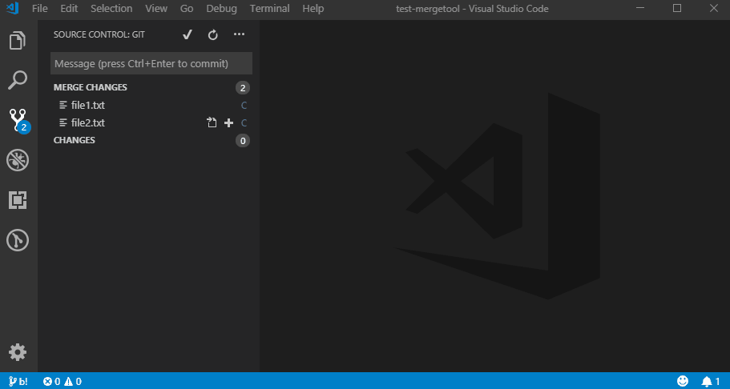

# Git Diff and Merge Tool

Diff and merge tools can be integrated with Git so they are launched with `git difftool <file>` and `git mergetool <file>`.

This extension allows you to launch those tools from Visual Studio Code.

## Demo



## Setup

To register your diff/merge tool with Git you need to edit your `.gitconfig` file:

`git config --global --edit`

For example, this sets up Beyond Compare 4 on Windows:

```
[diff]
    tool = beyondcompare4
[difftool "beyondcompare4"]
    cmd = \"C:\\Program Files\\Beyond Compare 4\\bcomp.exe\" \"$LOCAL\" \"$REMOTE\"
[merge]
    tool = beyondcompare4
[mergetool]
    keepbackup = false
[mergetool "beyondcompare4"]
    cmd = \"C:\\Program Files\\Beyond Compare 4\\bcomp.exe\" \"$REMOTE\" \"$LOCAL\" \"$BASE\" \"$MERGED\"
    trustexitcode = true
```

`keepbackup = false` prevents the system from creating `.orig` backup files after a merge. `trustexitcode = true` tells Git that the diff tool's exit code can be trusted to determine the outcome of the merge.